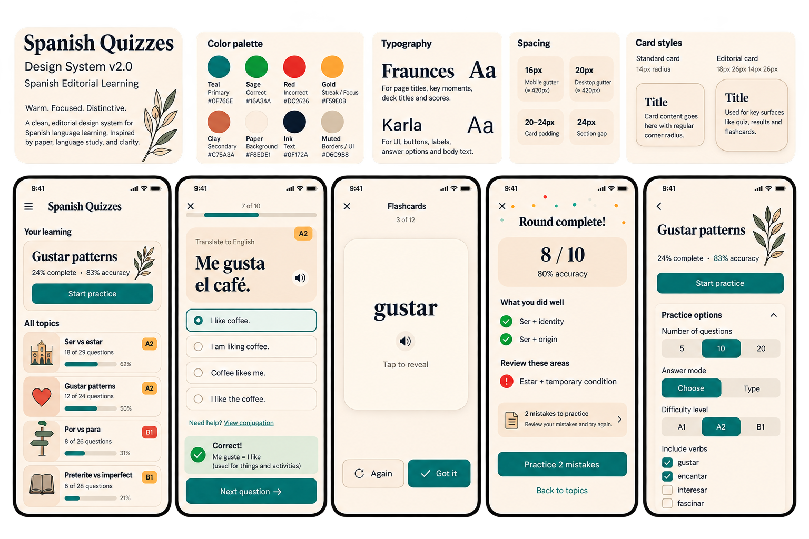

# Spanish Quizzes: Spanish Editorial Learning

Design-system specification derived from the shared **Spanish Learning App Design System** image. Documentation only; no application styles or behavior are changed.

## Source and status

- [Shared reference](https://chatgpt.com/s/m_6ab3f5b27f448191a9f737ba3950d646), inspected 23 September 2026.
- The board labels itself **Design System v2.0** and describes the direction as **Warm. Focused. Distinctive.** This is the reference's version, not an application release.
- [Original reference image](reference.png) is preserved unchanged.
- **Reference** means directly legible or visible in the image. **Specification** means a proposed rule that completes the static reference for later implementation. Proposed rules are not claims about current app behavior.
- The image contains generated text, inconsistent examples, and incomplete interaction states. It supplies visual direction, not an executable or fully accessible design contract.

## Contents

| File | Purpose |
|---|---|
| [Foundations](foundations.md) | Palette, type, spacing, shapes, imagery, motion, and accessibility |
| [Components and flows](components.md) | Reusable component contracts and the five reference screens |
| [Review and adoption](review.md) | Design critique, repository differences, and future acceptance checks |
| [Tokens](tokens.json) | Machine-readable reference values and separately labeled proposed values |
| [Reference image](reference.png) | Source board for visual comparison |

## Design intent

A quiet Spanish study notebook: warm paper, dark editorial headings, compact learning controls, and teal calls to action. Fraunces gives topic titles and Spanish prompts character; Karla makes answers and controls easy to scan. Botanical line art acts as a restrained signature on topic introductions, not as decoration around every answer.

The primary job is to move a learner from choosing a topic to practicing, understanding feedback, and reviewing mistakes. One prominent next action per screen. Decoration, statistics, and settings must remain secondary to the learning task.

## Scope and authority

This folder is a candidate design system based on the supplied reference. The repository's [DESIGN.md](../../DESIGN.md) and [UX-CONTRACT.md](../../UX-CONTRACT.md) remain the existing application contracts. Adoption requires reconciling their differences, listed in [review.md](review.md). This documentation does not approve a runtime redesign, data migration, or changes to scoring, persistence, or spaced repetition.

Only light-theme mobile screens appear in the reference. Desktop layout, dark theme, keyboard behavior, type sizes, and unshown states are explicitly specified as extensions or left for an adoption decision.

